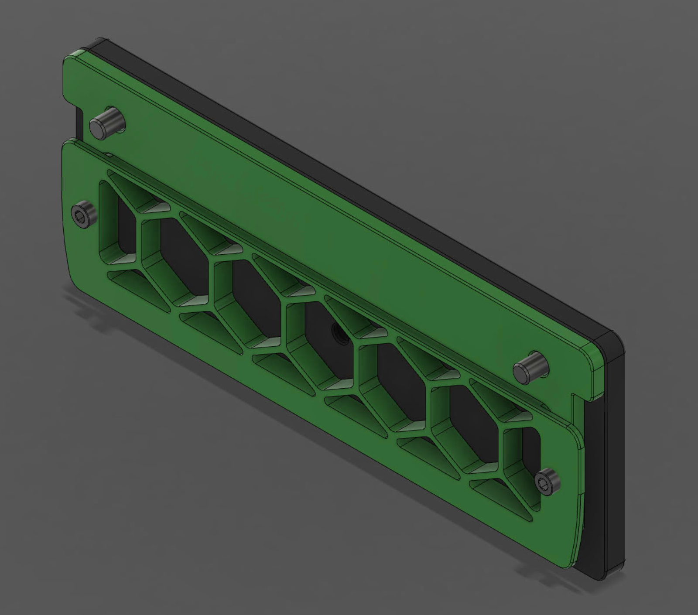

# Exhaust Block Off Plate

Replaces the stock exhaust housing on the back of V2.4/V1.8/Trident while retaining the stock grill inside the chamber.

This helps retain some heat in the chamber. (Seeing 67ºC chamber temps in a 350 V2.4 with 2 bedfans)

BOM

x2 M3 Heatset Inserts

x2 M5x16 BHCS

x2 M3x8 SHCS

x1 BSP Adapter fitting (Holds the bowden tube. Same part as used on the stock exhaust housing)

