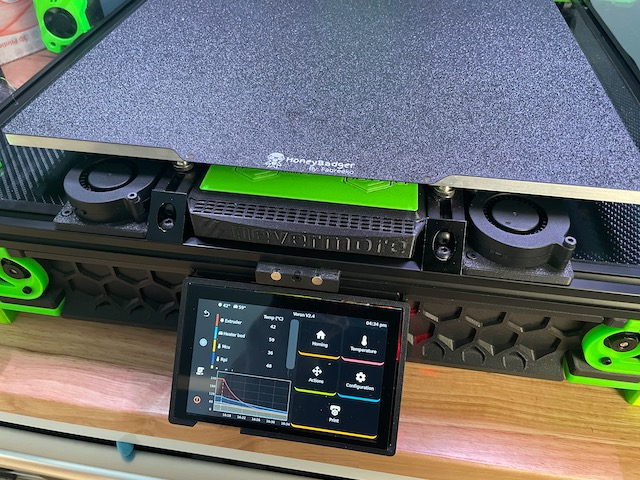
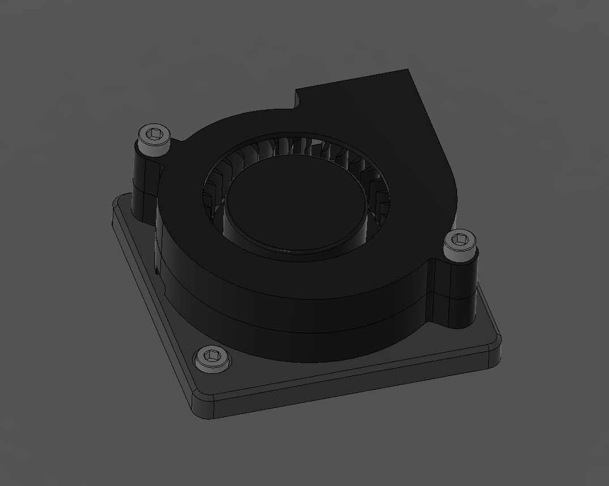
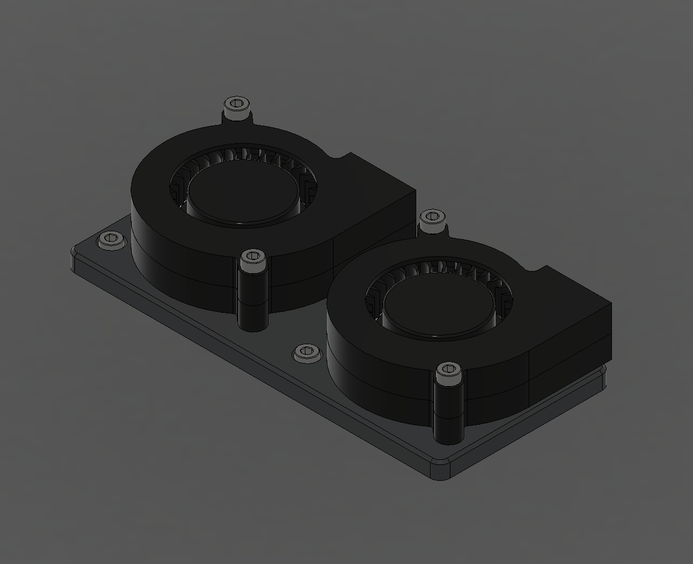
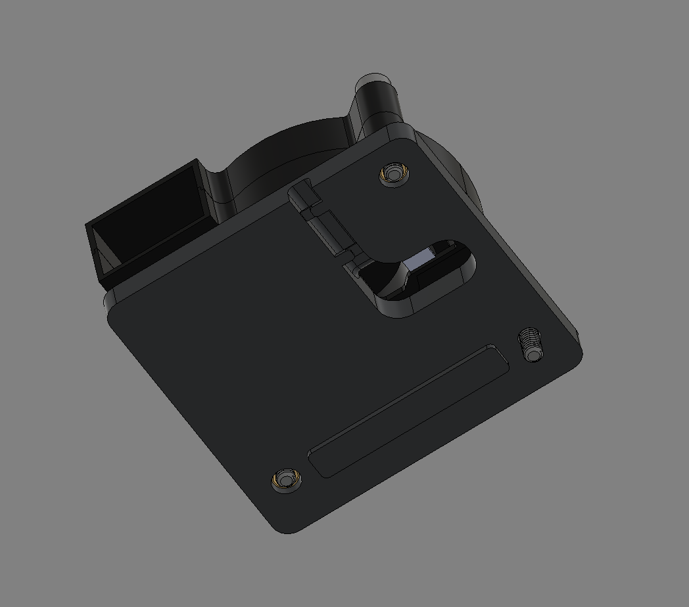
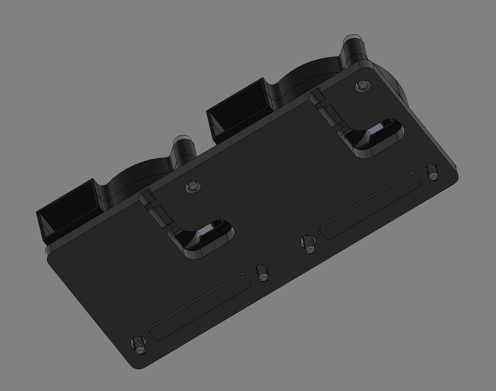
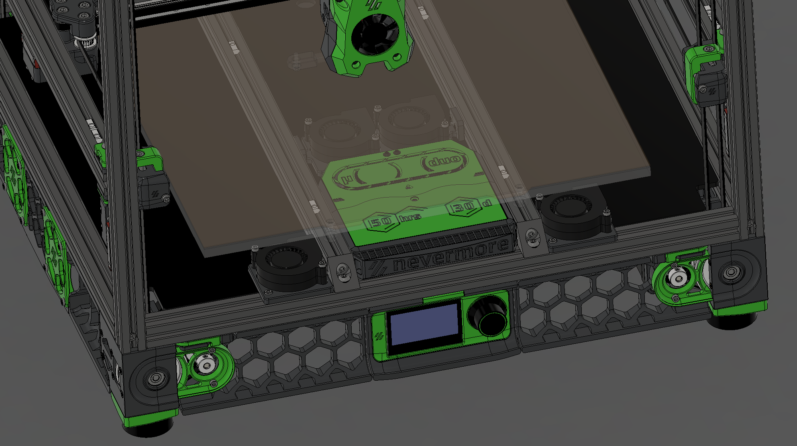
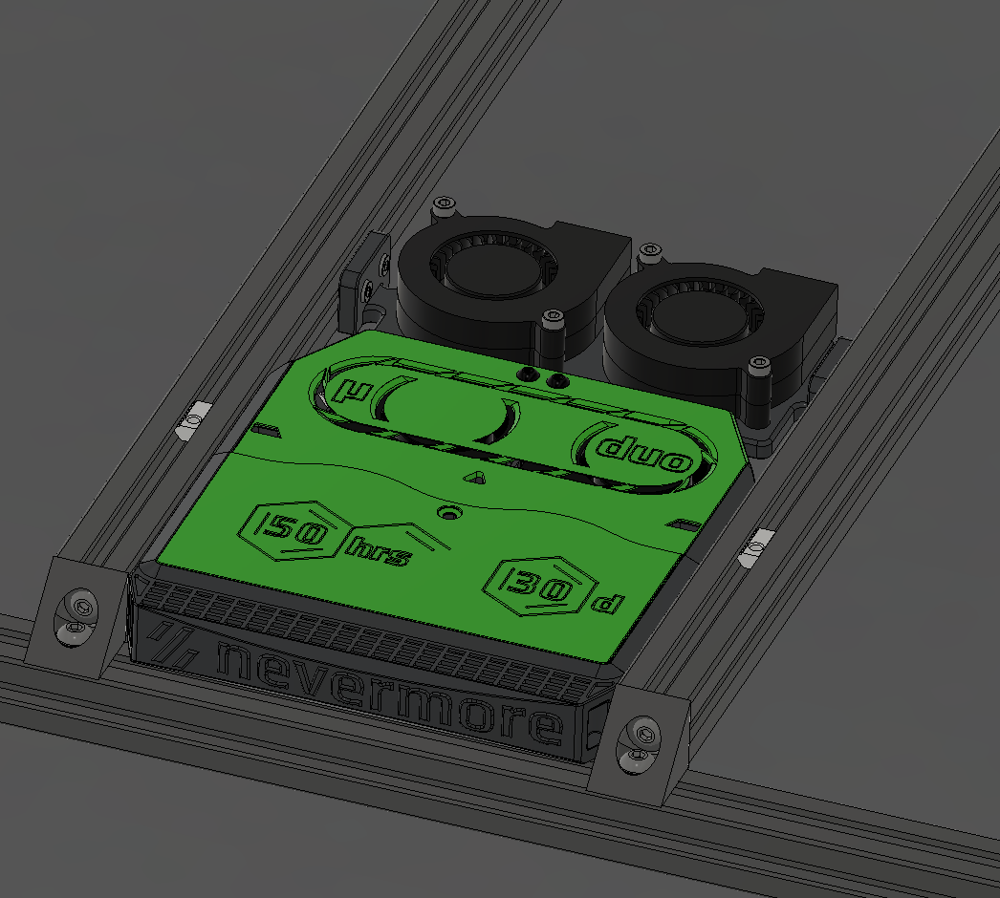

# Improved Bed Fan Mounts

## What has been improved?

Glad you asked. Lots.

* Added wire channel/routing
* Improved mounting to the frame. Should be able to lock solid now with T-Nuts
* Second fan hole can be used with a heatset, or through bolted instead
* Option for Dual fan in a single mount

---

The difference between running bedfans in the middle vs having a nevermore micro in the middle is somewhat significant. Lets do both and make sure those fans in the middle has as short of life as possible.

* These under the bed fan mounts mount between the bed rails. Similar to bed WAGO mounting.
* Available in single or dual fan.
* Wiring channels are run front and back for multiple routing options.

*Testing has yet to be done for more than a couple minutes. But it seems fine in my machine.*

